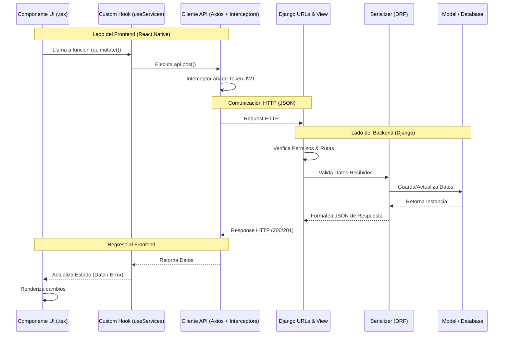

# Guía de Flujo de Datos (Arquitectura API)

Esta guía explica el camino que recorre una petición desde que un usuario pulsa un botón en el celular hasta que se guarda en la base de datos y regresa la respuesta.

---

## 1. Diagrama de Flujo (End-to-End)

---

## 2. Archivos Clave del Flujo

### En el Frontend (`Fronted/`)
1.  **`services/api.ts`**: Es el "motor". Aquí se configura la URL base y se inyectan automáticamente los **Tokens JWT** antes de cada envío.
2.  **`hooks/useServices.ts` (y otros hooks)**: Orquestan la llamada. Usan `React Query` para manejar estados de carga (`isLoading`) y errores.
3.  **`services/userService.ts` (Services)**: Contienen las definiciones de las funciones que llaman a endpoints específicos.
4.  **`app/service-detail/[id].tsx` (Componentes)**: Son el punto de entrada del usuario. Aquí es donde se "dispara" el flujo.

### En el Backend (`Backend/`)
1.  **`core/urls.py`**: El receptor principal. Decide a qué aplicación (`users`, `services`, `support`) va la petición.
2.  **`apps/[modulo]/urls.py`**: El selector local. Mapea la ruta específica (ej: `requests/`) a una función o ViewSet.
3.  **`apps/[modulo]/views.py`**: El "cerebro". Aquí se verifica si el usuario tiene permiso (ej: `IsAuthenticated`) y se ejecuta la lógica de negocio.
4.  **`apps/[modulo]/serializers.py`**: El "traductor". Convierte los datos que vienen del móvil a objetos de Python y viceversa.
5.  **`apps/[modulo]/models.py`**: La "memoria". Define cómo se guardan los datos en la base de datos PostgreSQL.

---

## 3. Ejemplo Práctico: Aceptar una Labor

1.  **Operaria** pulsa "Aceptar Labor" en el móvil.
2.  `useAcceptService` dispara un `POST` a `/api/services/requests/{id}/accept/`.
3.  **Frontend/services/api.ts** añade el `Bearer Token` de la operaria.
4.  **Backend/apps/services/views.py** recibe la petición en `ServiceRequestViewSet.accept()`.
5.  **Serializer** valida que la labor esté `PENDING`.
6.  **View** cambia el estado de la labor y asigna a la operaria en la **DB**.
7.  El móvil recibe la labor actualizada y la pantalla cambia a "Iniciada".
